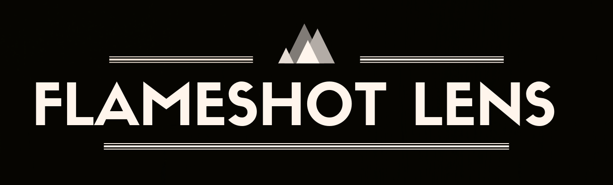
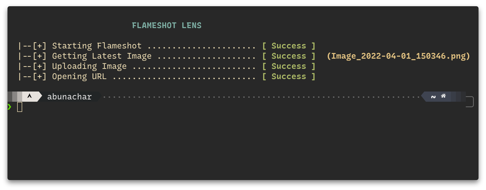
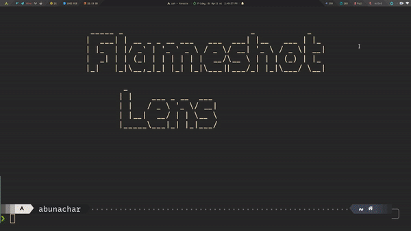

<div style="text-align:center"></div>

---

Do fork and star 🌟 this repository if you like it.

### Prerequisites

- [x] Flameshot
- [x] Any Shell
- [x] Curl

### Usage

#### Via Terminal

> For accessing the Scripts from any Directory or location in your System

**Option 1:**

Add `flameshot-lens` script in `$HOME/.local/bin`

**Option 2:**

- Create a Directory named `bin` in your home Directory
- copy the `flameshot-lens` script and paste in `$HOME/bin`
- This bin directory will contain all the Scripts in it
- Add the bin directory in your home path and add that home path in Path

  - add this line in your `.bashrc` or `.zshrc` or shell configuration of your shell you are using

  ```
  PATH="$HOME/bin:$PATH
  ```

- You are good to go Now you can access the Scripts in the bin directory from and Directory or location in terminal.

**Preview** :

<div style="text-align:center"></div>

#### Via Shortcut

- Add keyboard shortcut as per your DM/WM
- Eg. for sxhkd , add this below line

```
super + shift + Print
      $HOME/bin/flameshot-lens
```

**Preview** :

<div style="text-align:center"></div>

### Troubleshoot

- Change the Shebang\* of the Script if you are Using the Different Shell or the path of the shell doesnt match with the default location of the shell installed

  > `A shebang is the character sequence consisting of the characters number sign and exclamation mark ( #!) at the beginning of a script. `

- `permission denied: <Script Name>`, **Fix** `chmod +x <Script name>`

Made with ❤️ in India
